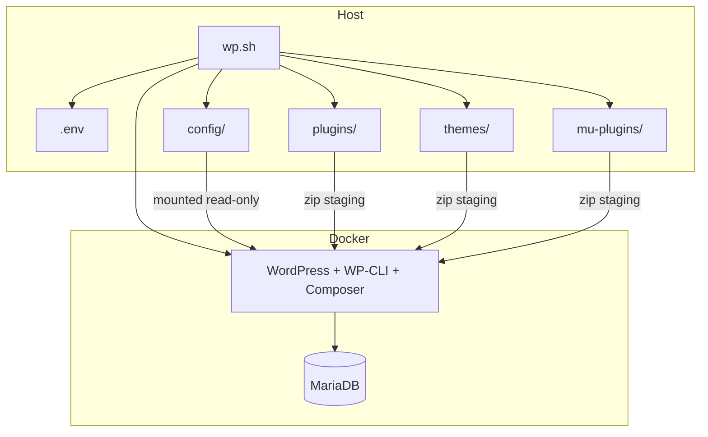

# WordPress Docker Dev Stack

A local WordPress development environment powered by Docker. Drop plugin, theme, and must-use plugin archives into host folders, run a single script, and get a fully configured WordPress site with WP-CLI, Composer, and managed `wp-config.php` settings.

Built for plugin and theme testing — no local PHP, MySQL, or Apache installation required.

## Features

- **WordPress 7 + PHP 8.2 + Apache** — pinned official Docker image, overridable via `.env`
- **MariaDB 10.11** with health checks and persistent volumes
- **One-command setup** — `./wp.sh` builds containers, installs WordPress, syncs config, and deploys extensions
- **Zip-only host folders** — archives stay on the host; extraction happens inside the container
- **Plugins, themes, and MU-plugins** — drop `.zip` files, folders, or single-file `.php` plugins
- **wp-config management** — common constants from `.env`, advanced PHP overrides from `config/`
- **Custom local domains** — e.g. `newsite.local` via `.env` and `/etc/hosts`
- **WP-CLI + Composer** pre-installed in the WordPress container

## Requirements

- [Docker](https://docs.docker.com/get-docker/) (Docker Desktop, Engine, or compatible)
- Docker Compose v2 (`docker compose`) or legacy `docker-compose`
- Bash

## Quick start

```bash
git clone https://github.com/Netlogpro/wp-docker.git
cd docker

# First run creates .env and config/wp-config.extra.php from templates
chmod +x wp.sh
./wp.sh
```

Open the site URL printed at the end (default: `http://localhost:8080`).

| | Default |
|---|---|
| **Site** | `http://localhost:8080` |
| **wp-admin** | `http://localhost:8080/wp-admin/` |
| **Username** | `admin` |
| **Password** | `admin` |

> Change credentials in `.env` before sharing or exposing this stack.

## Project structure

```
docker/
├── wp.sh                        # Main entry point — start, configure, deploy
├── docker-compose.yml           # WordPress + MariaDB services
├── Dockerfile                   # Extends official WordPress image (WP-CLI, Composer)
├── .env.example                 # Environment template (copy → .env)
├── config/
│   ├── bootstrap.php            # Loads wp-config snippets (tracked)
│   ├── wp-config.extra.php.example
│   ├── wp-config.extra.php      # Local overrides (gitignored, auto-created)
│   └── wp-config.d/             # Optional modular PHP snippets
├── plugins/                     # Plugin .zip archives (gitignored contents)
├── mu-plugins/                  # Must-use plugin archives / files
└── themes/                      # Theme .zip archives / folders
```

## Commands

```bash
./wp.sh                  # Build/start containers and configure WordPress
./wp.sh down             # Stop containers (data volumes kept)
./wp.sh reset            # Stop containers and delete all data (full wipe)
./wp.sh exec <cmd ...>   # Run a command in the WordPress container
./wp.sh wp [args ...]    # Run WP-CLI (wp --allow-root) in the container
./wp.sh shell            # Open an interactive shell in the container
./wp.sh sync             # Re-apply plugins, mu-plugins, themes, and wp-config
./wp.sh phpmyadmin       # Full WordPress setup plus phpMyAdmin
./wp.sh logs             # Follow WordPress container logs
./wp.sh help             # Show usage
```

### Container interaction

| Command | Purpose |
|---|---|
| `./wp.sh shell` | Interactive bash session in the WordPress container |
| `./wp.sh exec <cmd>` | Run a single command (non-interactive or with TTY when attached) |
| `./wp.sh wp <args>` | WP-CLI shorthand (`wp --allow-root`) |
| `./wp.sh logs` | Follow WordPress container logs (`docker compose logs -f wordpress`) |

Containers must be running (start with `./wp.sh` if needed).

```bash
# Interactive shell
./wp.sh shell

# WP-CLI shorthand
./wp.sh wp plugin list
./wp.sh wp option get siteurl
./wp.sh wp cron event run --due-now

# Run any command in the WordPress container
./wp.sh exec ls -la /var/www/html/wp-content/plugins
./wp.sh exec composer --version
```

`exec` and `wp` detect whether your terminal is interactive and allocate a TTY when appropriate.

### Sync changes

After updating host folders or `.env` wp-config values, re-apply without a full rebuild:

```bash
./wp.sh sync
```

This will:

1. Ensure containers are running (no image rebuild)
2. Sync `wp-config` from `.env` and `config/`
3. Re-install/re-activate plugins from `plugins/`
4. Re-deploy must-use plugins from `mu-plugins/`
5. Re-install themes from `themes/`
6. Activate `WP_DEFAULT_THEME` if set

Folder-based plugins, mu-plugins, and themes are fully replaced in the container on each sync.

### phpMyAdmin

Run the full WordPress setup **and** start phpMyAdmin:

```bash
./wp.sh phpmyadmin
```

This does everything `./wp.sh` does (build, install WordPress, sync plugins/themes/config), plus starts phpMyAdmin on a separate port.

| Service | Default URL | Port env |
|---|---|---|
| **WordPress** | `http://localhost:8080` | `WORDPRESS_PORT` |
| **phpMyAdmin** | `http://localhost:8081` | `PHPMYADMIN_PORT` |

`PHPMYADMIN_PORT` **must** differ from `WORDPRESS_PORT` (validated by `./wp.sh phpmyadmin`).

| phpMyAdmin login | Default |
|---|---|
| **Server** | `db` |
| **Root user** | `root` / `MYSQL_ROOT_PASSWORD` from `.env` |
| **WP DB user** | `wordpress` / `WORDPRESS_DB_PASSWORD` from `.env` |

phpMyAdmin is only started when you run `./wp.sh phpmyadmin` (which runs the full setup). A normal `./wp.sh` starts `db` and `wordpress` only, so there is no port conflict and no orphan-container warnings. `./wp.sh down` and `./wp.sh reset` stop whatever is currently running.

### Docker Compose shortcuts

```bash
./wp.sh logs
docker compose exec wordpress wp --allow-root config get WP_DEBUG
```

## Configuration

Copy `.env.example` to `.env` (done automatically on first run) and edit as needed.

### Ports and image

| Variable | Default | Description |
|---|---|---|
| `WORDPRESS_PORT` | `8080` | Host port mapped to WordPress container port 80 |
| `PHPMYADMIN_PORT` | `8081` | Host port for phpMyAdmin — must differ from `WORDPRESS_PORT` |
| `WORDPRESS_IMAGE` | `wordpress:7.0.0-php8.2-apache` | Base WordPress Docker image tag |

### Database

| Variable | Default |
|---|---|
| `WORDPRESS_DB_NAME` | `wordpress` |
| `WORDPRESS_DB_USER` | `wordpress` |
| `WORDPRESS_DB_PASSWORD` | `wordpress` |
| `MYSQL_ROOT_PASSWORD` | `root` |

### WordPress install

| Variable | Default | Description |
|---|---|---|
| `WP_SITE_TITLE` | `Wordpress Test Site` | Site title |
| `WP_ADMIN_USER` | `admin` | Admin username |
| `WP_ADMIN_PASSWORD` | `admin` | Admin password |
| `WP_ADMIN_EMAIL` | `admin@example.com` | Admin email |
| `WP_SITE_URL` | *(empty)* | Custom site URL; see [Custom domain](#custom-domain) |
| `WP_DEFAULT_THEME` | *(empty)* | Theme slug to activate after install |

### wp-config constants

Applied on every `./wp.sh` run via WP-CLI. Leave blank to skip a constant.

| Variable | Example | Description |
|---|---|---|
| `WP_DEBUG` | `true` | Enable debug mode |
| `WP_DEBUG_LOG` | `true` | Log errors to `wp-content/debug.log` |
| `WP_DEBUG_DISPLAY` | `false` | Show errors on screen |
| `WP_MEMORY_LIMIT` | `256M` | Front-end memory limit |
| `WP_MAX_MEMORY_LIMIT` | `512M` | Admin memory limit |
| `DISALLOW_FILE_EDIT` | `false` | Disable theme/plugin editor in admin |
| `WP_POST_REVISIONS` | `5` | Number of post revisions to keep |

## Plugins

Drop files into `plugins/` and re-run `./wp.sh`.

| Host entry | What happens |
|---|---|
| `*.zip` | Installed and activated inside the container via WP-CLI |
| Plugin folder | Copied into the container; `composer install` runs if needed; then activated |
| Single `*.php` file | Copied and activated |

The host `plugins/` folder stays clean — zip archives are **not** extracted on the host.

```
plugins/
├── my-plugin.zip
├── another-plugin.zip
└── .gitkeep
```

## Must-use plugins

Drop files into `mu-plugins/` and re-run `./wp.sh`. Must-use plugins load automatically — no activation step.

| Host entry | What happens |
|---|---|
| `*.zip` | Extracted into `wp-content/mu-plugins/` inside the container |
| Plugin folder | Copied into the container |
| Single `*.php` file | Copied into the container |

> WordPress only auto-loads `.php` files directly in `mu-plugins/`. If a zip extracts into a subfolder, add a loader `.php` at the top level that `require`s the main plugin file.

## Themes

Drop files into `themes/` and re-run `./wp.sh`.

| Host entry | What happens |
|---|---|
| `*.zip` | Installed inside the container via WP-CLI |
| Theme folder | Copied into the container |

Set `WP_DEFAULT_THEME` in `.env` to the theme **folder name** (slug) to activate it:

```env
WP_DEFAULT_THEME=astra
```

Leave `WP_DEFAULT_THEME` empty to keep the current active theme unchanged.

List installed themes:

```bash
docker compose exec wordpress wp --allow-root theme list
```

## wp-config management

Configuration uses two layers:

### 1. `.env` constants (common settings)

Edit values in `.env` and run `./wp.sh`. Constants are applied with `wp config set` on every run, so changes work even when data volumes already exist.

### 2. `config/` PHP files (advanced overrides)

| File | Purpose |
|---|---|
| `config/wp-config.extra.php` | Custom `define()` calls and PHP logic |
| `config/wp-config.d/*.php` | Optional modular snippets, loaded in sorted order |

On first run, `wp-config.extra.php` is created from `wp-config.extra.php.example`. The example includes:

```php
define('WP_CRON_LOCK_TIMEOUT', 30);
```

`config/` is mounted read-only at `/docker-config/` inside the container. `wp.sh` ensures `wp-config.php` includes the bootstrap loader on each run.

## Custom domain

Use a local domain instead of `localhost`:

**1. Set in `.env`:**

```env
WORDPRESS_PORT=8080
WP_SITE_URL=newsite.local
```

If no port is given and `WORDPRESS_PORT` is not `80`, `wp.sh` appends the port automatically (`http://newsite.local:8080`).

**2. Add to your hosts file:**

```text
# Linux / macOS: /etc/hosts
# Windows: C:\Windows\System32\drivers\etc\hosts
127.0.0.1  newsite.local
```

**3. Re-run:**

```bash
./wp.sh
```

To use `http://newsite.local` without a port in the URL, set `WORDPRESS_PORT=80` (may require elevated privileges to bind port 80).

## How it works



On each `./wp.sh` run:

1. Containers are built and started
2. WordPress core is installed (if needed)
3. Permalinks and `wp-config` are synced from `.env` and `config/`
4. Plugins, MU-plugins, and themes are deployed from host folders
5. Default theme is activated (if `WP_DEFAULT_THEME` is set)

WordPress files and the database persist in Docker volumes (`wordpress_data`, `db_data`) across restarts. Use `./wp.sh reset` for a clean slate.

## Troubleshooting

### Port already in use

Change `WORDPRESS_PORT` in `.env` (e.g. `8081`) and re-run `./wp.sh`.

### Custom domain does not load

- Confirm the hosts file entry points to `127.0.0.1`
- Check that the port in the browser matches `WORDPRESS_PORT`
- Re-run `./wp.sh` after changing `WP_SITE_URL`

### Plugin or theme zip fails to install

- Ensure the zip is a valid WordPress plugin/theme archive
- Check logs: `./wp.sh logs`
- Verify the folder name inside the zip matches the expected slug

### wp-config changes not applied

- Re-run `./wp.sh` (constants from `.env` are synced on every run)
- For `config/wp-config.extra.php` changes, a re-run ensures the bootstrap include is present
- Inspect values: `docker compose exec wordpress wp --allow-root config list`

### WordPress version after image upgrade

Rebuilding the image does not upgrade core inside an existing volume. Either:

```bash
./wp.sh reset && ./wp.sh          # clean install
```

or upgrade in place:

```bash
docker compose exec wordpress wp --allow-root core update
```

## License

This project is provided as a development tool. WordPress and third-party plugins/themes are subject to their own licenses.
